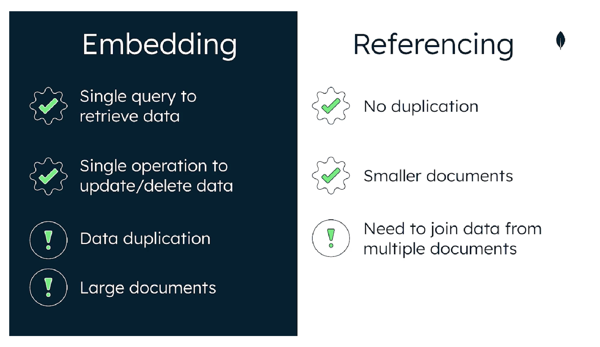

# The MongoDB Document Model
- MongoDB documents are displayed in JSON format but stored in **BSON** (Binary JSON)
- Compared to JSON, BSON supports additional data types like dates, numbers, and ObjectIds
- **ObjectId**: A **data type** used to create unique identifiers for the required `_id` field
- If no `_id` is present, MongoDB will create one
- **Flexible schema**: MongoDB allows documents in the same collection to have different structures
- **Polymorphic**: Documents in a collection can have different shapes and fields
- **Optional schema validation**: MongoDB allows defining validation rules to ensure data integrity while maintaining flexibility
- **Document values**: Can be any data type, including strings, objects, arrays, booleans, nulls, dates, ObjectIds, etc

## Syntax of a MongoDB Document

```js
{
  "key": value,
  "key": value,
  "key": value
}
```

**Example:**

```js
{
  "_id": 1,
  "name": "AC3 Phone",
  "colors": ["black", "silver"],
  "price": 200,
  "available": true
}
```

## Data Modeling
- **Data Modeling**: The process of creating a data model to define the structure, relationships, and constraints of data
- **Schema**: The relationship of data inside the database
- A good data model can make it easier to manage the data, enable more efficient queries, use less memory and CPU, and reduce costs
- "Data that is accessed together must be stored together"
- Polymorphism is not schema-less; it's schema-flexible: you define a schema and put validation
- **Embedded document model**: A way to store related data within a single document

### Data Relationships
Rememebr: "*Data that is accessed together should be stored together*", modeling one-to-one, one-to-many, and many-to-many relationships is easy:

#### One-to-One
```js
{
  "_id": ObjectId("60c72b2f9af1b2c4d6d5e8e1"),
  "name": "Alice",
  "address": {
    "street": "123 Main St",
    "city": "Anytown"
  }
}
```

#### One-to-Many
```js
{
  "_id": ObjectId("60c72b2f9af1b2c4d6d5e8e2"),
  "name": "Store",
  "products": [
    {
      "productId": ObjectId("60c72b2f9af1b2c4d6d5e8e3"),
      "name": "Product 1"
    },
    {
      "productId": ObjectId("60c72b2f9af1b2c4d6d5e8e4"),
      "name": "Product 2"
    }
  ]
}
```

#### Many-to-Many
```js
{
  "_id": ObjectId("60c72b2f9af1b2c4d6d5e8e5"),
  "studentName": "John",
  "courses": [
    {
      "courseId": ObjectId("60c72b2f9af1b2c4d6d5e8e6"),
      "courseName": "Math"
    },
    {
      "courseId": ObjectId("60c72b2f9af1b2c4d6d5e8e7"),
      "courseName": "Science"
    }
  ]
}
```
```js
{
  "_id": ObjectId("60c72b2f9af1b2c4d6d5e8e6"),
  "courseName": "Math",
  "students": [
    {
      "studentId": ObjectId("60c72b2f9af1b2c4d6d5e8e5"),
      "studentName": "John"
    },
    {
      "studentId": ObjectId("60c72b2f9af1b2c4d6d5e8e8"),
      "studentName": "Jane"
    }
  ]
}
```

- Two primary ways of modeling data relationships in MongoDB are **embedding** and **referencing**

#### Embedding

  - Embedding is when related data is stored within a single document
  - Example (One-to-Many):
    ```js
    {
      "_id": ObjectId("60c72b2f9af1b2c4d6d5e8e9"),
      "name": "Blog Post",
      "comments": [
        {
          "commentId": ObjectId("60c72b2f9af1b2c4d6d5e8ea"),
          "text": "Great post!",
          "author": "Alice"
        },
        {
          "commentId": ObjectId("60c72b2f9af1b2c4d6d5e8eb"),
          "text": "Thanks for sharing.",
          "author": "Bob"
        }
      ]
    }
    ```

 #### Referencing
  - Referencing is when related data is stored in separate documents, and references (usually ObjectIds) are used to link them
  - Example (One-to-Many):
    ```js
    // Blog Post document
    {
      "_id": ObjectId("60c72b2f9af1b2c4d6d5e8ec"),
      "name": "Blog Post"
    }

    // Comments documents
    {
      "_id": ObjectId("60c72b2f9af1b2c4d6d5e8ea"),
      "postId": ObjectId("60c72b2f9af1b2c4d6d5e8ec"),
      "text": "Great post!",
      "author": "Alice"
    },
    {
      "_id": ObjectId("60c72b2f9af1b2c4d6d5e8eb"),
      "postId": ObjectId("60c72b2f9af1b2c4d6d5e8ec"),
      "text": "Thanks for sharing.",
      "author": "Bob"
    }
    ```

### More on Embedding & Referencing
- **Embedding**: Store related data in a single document (nested document)
  - Suitable for any relationship model (1-1, 1-M, M-M)
  - Simplifies and minimizes queries
  - **Warning**: Can lead to larger, unbounded documents (max 16MB BSON), which is a schema anti-pattern
- **Referencing**: Also known as linking or data normalization
  - Avoids duplication of data
  - Results in smaller documents
  - May require more extensive queries



### Scaling a Data Model
- **Efficiency**: Focus on query result time, memory usage, CPU usage, and storage
- Avoid unbounded documents (documents that grow infinitely):
  - Require more space
  - Impact write performance
  - Make pagination difficult
  - Maximum document size is 16MB
- Avoid:
  - Documents larger than 16MB
  - Poor query performance
  - Poor write performance
  - Excessive memory usage

### Schema Anti-Patterns
- **Tools**: Use Atlas tools like Data Explorer and Performance Advisor
- **Schema Design Pattern**: Well-defined data structure ensuring optimal performance and scalability
- **Schema Anti-Pattern**: Leads to sub-optimal performance and non-scalable solutions
  - Common issues:
    - Massive arrays
    - Large number of collections
    - Bloated documents
    - Unnecessary indexes
    - Queries without indexes
    - Data accessed together but stored in different collections

- **Atlas Tools**:
  - Data Explorer (available in the free tier)
  - Performance Advisor (available in the M10 tier and up)
