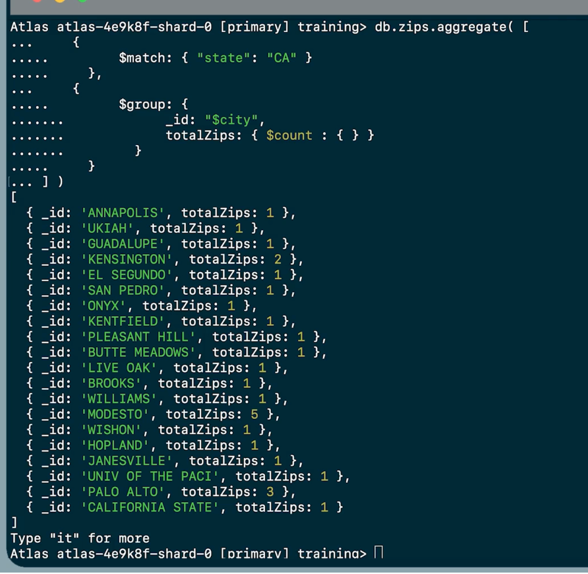
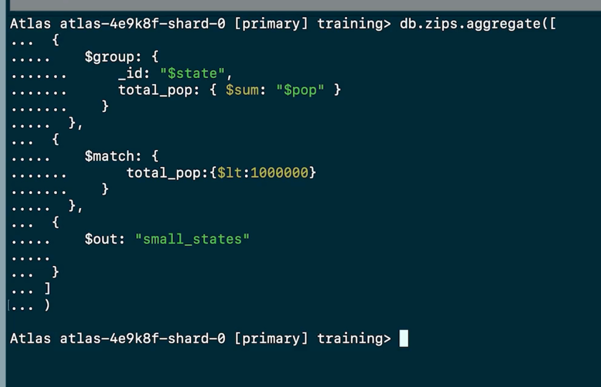

# Aggregation
- A way to filter, sort, group, reshape, and analyze data
- **Aggregation**: Collection and summary of data
- **Stage**: A built-in method that can be performed on the data without permanently altering it (e.g., `$match`, `$group`, `$sort`, `$limit`, `$project`, `$set`, `$count`, `$out`)
- **Order of Stages**: Specifies the sequence of operations the data will go through
- **Aggregation Pipeline**: A series of stages performed on the data in order
- **Field References**: Use `$` to reference fields within the pipeline (`"$fieldName"`, `"$first_name"`)

## Structure of an Aggregation Pipeline
```js
db.collection.aggregate([
  { $stage1: { expression1, expression2 } },
  { $stage2: { expression1 } },
])
```

## `$match` & `$group` Stages

### `$match`
**Filters** documents that match specified conditions. It works like a find command
  ```js
  {
    $match: { "field_name": "value" }
  }

  // Example
  {
    $match: { size: "small" }
  }
  ```

### `$group`
Groups documents by a group key
  ```js
  {
    $group: {
      _id: <expression>, // Group key
      <field>: { <accumulator> : <expression> }
    }
  }
  ```

### `$match` and `$group` in an Aggregation Pipeline (Examples)

- Find documents with the field "state" matching "CA" and group them by the city, showing the total number of zip codes in California:
  ```js
  db.zips.aggregate([
    { $match: { state: "CA" } },
    { $group: { _id: "$city", totalZips: { $sum: 1 } } }
  ])
  ```

- One document for each city in Texas (TX):
  ```js
  db.zips.aggregate([
    { $match: { state: "TX" } },
    { $group: { _id: "$city" } }
  ])
  ```

- Another example:


## `$sort` & `$limit` Stages

### `$sort`
Sorts all input documents and returns them in sorted order. Use `1` for ascending order and `-1` for descending order
  ```js
  {
    $sort: { "field_name": 1 }
  }
  ```

### `$limit`
Limits the number of documents returned
  ```js
  {
    $limit: 5
  }
  ```

### `$sort` and `$limit` in an Aggregation Pipeline (Examples)

- Sort documents by `pop` in descending order and limit the output to the first five documents:
  ```js
  db.zips.aggregate([
    { $sort: { pop: -1 } },
    { $limit: 5 }
  ])
  ```

- One document for the population of each zip code, sorted in descending order:
  ```js
  db.zips.aggregate([
    { $group: { _id: "$pop" } },
    { $sort: { _id: -1 } }
  ])
  ```

- 10 documents, each containing the population of a zip code as the `_id`, sorted by population in descending order:
  ```js
  db.zips.aggregate([
    { $group: { _id: "$pop" } },
    { $sort: { _id: -1 } },
    { $limit: 10 }
  ])
  ```

## `$project`, `$count` & `$set` Stages

### `$project`
Specifies the fields to include or exclude in the output documents
  ```js
  {
    $project: {
      state: 1,
      zip: 1,
      population: "$pop",
      _id: 0
    }
  }
  ```

### `$set`
Creates new fields or modifies existing fields
  ```js
  {
    $set: {
      place: { $concat: ["$city", ",", "$state"] },
      pop: 10000
    }
  }
  ```

### `$count`
Creates a new document with the count of documents at that stage
  ```js
  {
    $count: "total_zips"
  }
  ```

### Difference between `$set` and `$project`
- `$set` is used to create or change values of new or existing fields
- `$project` can be used to create or change the value of fields, but it can also be used to specify which fields to show in the documents in the aggregation pipeline

## `$out` Stage
- Creates a new collection from the output of an aggregation pipeline. It must be the last stage in the pipeline
- If the collection does not exist, it will be created. If it exists, the data will be overwritten
  ```js
  db.collection.aggregate([
    // other stages
    { $out: "new_collection_name" }
  ])
  ```
- Example with output:


## MongoDB Docs
- [Aggregation Operations](https://www.mongodb.com/docs/manual/aggregation)


